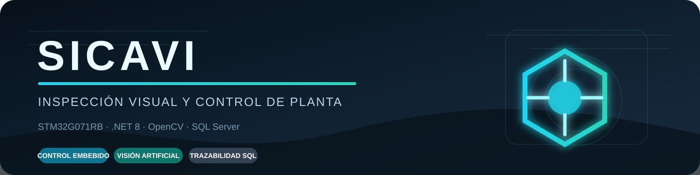
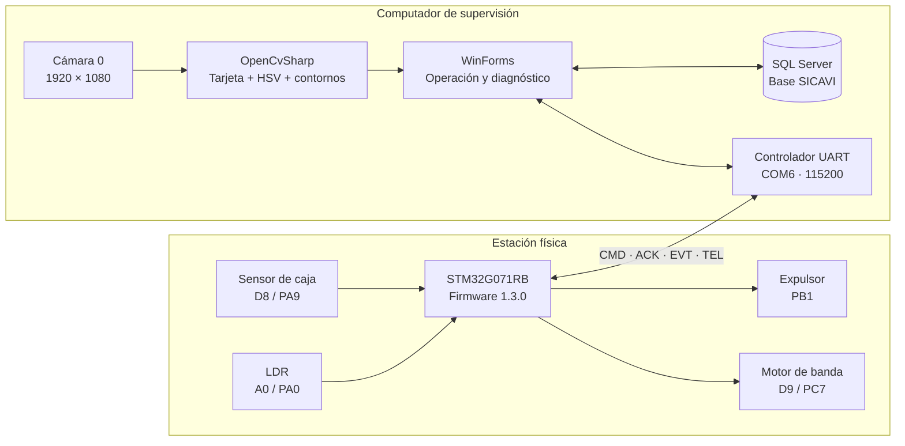
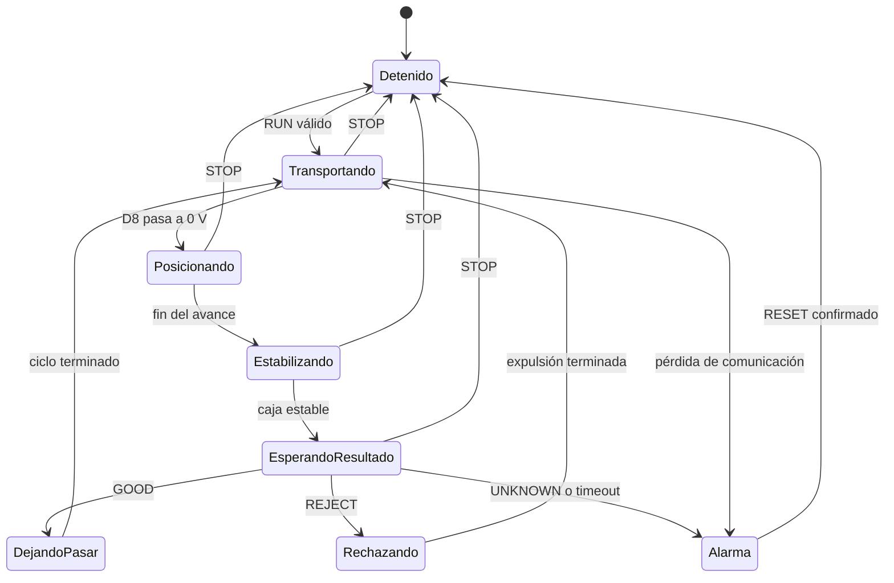

<p align="center">
  
</p>

<p align="center">
  
  
  
  
</p>

<p align="center">
  Proyecto final de UTESA para inspección visual, clasificación y control de una banda transportadora.
</p>

## Descripción

SICAVI integra una aplicación industrial de escritorio con una estación física basada en STM32. La cámara identifica figuras rojas o verdes —círculo, cuadrado o triángulo— sobre una tarjeta blanca. El microcontrolador posiciona la caja, detiene la banda, sincroniza la captura, recibe la decisión y controla el paso o rechazo del producto.

La solución incluye:

- Control embebido en una **NUCLEO-G071RB**, firmware `1.3.0`.
- Aplicación **C# WinForms sobre .NET 8** con interfaz industrial editable en Visual Studio.
- Visión artificial con **OpenCvSharp 4.13**.
- Comunicación UART confiable por el puerto virtual del ST-LINK.
- Inicio de sesión, registro y gestión de usuarios.
- Persistencia en **SQL Server** de inspecciones, horómetro, ciclos y alarmas.
- Herramientas de diagnóstico y pruebas de regresión.

## Resultado real de visión

<p align="center">
  
</p>

La imagen muestra las tres regiones usadas por el algoritmo: ROI general, tarjeta blanca localizada y región interior donde se calcula color y contorno. El borde de la caja se excluye antes de clasificar.

## Arquitectura del sistema



## Flujo automático de una caja

```mermaid
sequenceDiagram
    autonumber
    actor Operador
    participant UI as SICAVI C#
    participant MCU as STM32
    participant Sensor as Sensor D8
    participant Camara
    participant Vision as OpenCV
    participant SQL

    Operador->>UI: INICIAR
    UI->>MCU: CMD=RESET
    MCU-->>UI: ACK=RESET
    UI->>Camara: Abrir cámara 0
    UI->>MCU: CMD=RUN
    MCU-->>UI: ACK=RUN
    MCU->>MCU: Motor en marcha
    Sensor-->>MCU: Caja detectada, flanco bajo
    MCU->>MCU: Avance de posicionamiento y estabilización
    MCU-->>UI: EVT=DETECTED;ID=n
    UI->>Camara: Capturar fotograma nuevo
    Camara-->>Vision: Imagen de la caja
    Vision-->>UI: Color, forma y decisión
    UI->>SQL: Registrar inspección
    UI->>MCU: CMD=GOOD / REJECT / UNKNOWN
    MCU->>MCU: Dejar pasar, expulsar o activar alarma
    MCU-->>UI: EVT=FINISHED / EVT=ALARM
```

## Máquina de estados del firmware



## Estructura del repositorio

```text
SICAVI---Proyecto-Final-UTESA/
├── CSharp/SICAVI_Camara_STM32/        Aplicación .NET 8 WinForms
│   ├── src/Sicavi.WinForms/
│   │   ├── Communication/             UART, parser y telemetría
│   │   ├── Configuration/             Parámetros SQL y visión
│   │   ├── Data/                      Repositorios e inicialización
│   │   ├── Database/                  Script idempotente SICAVI.sql
│   │   ├── Forms/                     Los cinco formularios editables
│   │   ├── Models/                    Modelos del dominio
│   │   ├── Security/                  PBKDF2-SHA256
│   │   ├── Services/                  Captura de cámara
│   │   └── Vision/                    Color, forma y tarjeta blanca
│   └── SICAVI.sln
├── SICAVI_STM32_G071RB/               Proyecto STM32CubeIDE final
│   ├── Inc/                           Cabeceras y configuración
│   ├── Src/                           Firmware modular
│   ├── Drivers/                       HAL y CMSIS con licencias
│   ├── Startup/                       Inicio Cortex-M0+
│   └── SICAVI_STM32_G071RB.ioc
├── tools/Sicavi.HardwareProbe/        Pruebas físicas y de regresión
├── referencias/gpio_base/             Biblioteca GPIO académica de referencia
└── docs/                              Guías, informes, diagramas y evidencias
```

## Inicio rápido

### Requisitos

- Windows 10 u 11 de 64 bits.
- Visual Studio 2022 con **Desarrollo de escritorio de .NET** y SDK .NET 8.
- STM32CubeIDE 1.17 o compatible y STM32CubeProgrammer.
- SQL Server o SQL Server Express; la configuración incluida usa `.\WINCC`.
- NUCLEO-G071RB, webcam USB, sensor de caja activo en bajo y etapa de potencia aislada.

### Aplicación C#

1. Abre `CSharp/SICAVI_Camara_STM32/SICAVI.sln`.
2. Selecciona `Debug | x64`.
3. Ajusta `database-settings.json` si tu instancia no es `.\WINCC`.
4. Compila con `Ctrl+Shift+B` y ejecuta con `F5`.
5. En una base vacía se crea la cuenta temporal `admin / Sicavi@123`.
6. Cambia esa clave inmediatamente desde **GESTIÓN DE USUARIOS**.

### Firmware STM32

1. Importa `SICAVI_STM32_G071RB` en STM32CubeIDE.
2. Compila el proyecto `Debug`.
3. Programa la NUCLEO-G071RB por ST-LINK.
4. Asigna el puerto virtual de la placa a `COM6`.
5. Mantén libre `D8 / PA9` al iniciar: el sensor es activo en bajo.

Consulta la [guía de instalación y operación](docs/GUIA_INSTALACION_Y_USO.md) antes de energizar motor o relés.

## Formularios disponibles

| Formulario | Acceso | Función |
|---|---|---|
| `LoginForm` | Inicio de la aplicación | Autenticar usuario y abrir registro |
| `RegistrationForm` | “Registrar nuevo operador” | Crear una cuenta Operador |
| `MainForm` | Después del login | Operar cámara, visión y STM32 |
| `UserManagementForm` | “GESTIÓN DE USUARIOS”, solo Administrador | Crear, editar, activar y cambiar claves |
| `ProductionDataForm` | “DATOS DE PRODUCCIÓN” | Consultar inspecciones, conteos, horómetro y alarmas |

Todos conservan sus archivos `.Designer.cs` y `.resx`, por lo que la interfaz completa puede editarse visualmente en Visual Studio.

## Documentación técnica

- [Guía de instalación y uso](docs/GUIA_INSTALACION_Y_USO.md)
- [Informe final — implementación STM32](docs/INFORME_FINAL_STM32.md)
- [Informe final — implementación C#](docs/INFORME_FINAL_CSHARP.md)
- [Mapa de pines y conexiones](docs/MAPA_PINES_Y_CONEXIONES.md)
- [Protocolo UART](docs/PROTOCOLO_UART_CSHARP.md)
- [Plan de pruebas](docs/PRUEBAS_PASO_A_PASO.md)
- [Auditoría técnica y decisiones de mejora](docs/AUDITORIA_TECNICA_GPIO_RESET_VISION.md)

## Validación final

| Prueba | Resultado |
|---|---|
| Compilación C# Debug y Release | 0 errores, 0 advertencias |
| Compilación STM32 | Correcta; firmware 1.3.0 |
| Matriz sintética de visión | 6/6: 2 colores × 3 formas |
| Análisis de captura real | Verde + círculo, aceptada |
| Reinicio físico por COM6 | 10/10 ACK, motor apagado, alarma `NONE` |

La traza de la prueba física está disponible en [`docs/evidencias`](docs/evidencias/prueba-reset-firmware-1.3.0.log).

## Seguridad y operación

Este proyecto controla cargas físicas. El pin STM32 no debe alimentar directamente el motor o la bobina del relé. Usa transistor o driver, diodo de rueda libre, fuente apropiada, tierra común cuando corresponda y una parada de emergencia accesible. Nunca apliques 5, 12 o 24 V directamente a una entrada de 3.3 V.

La contraseña inicial es solo para el primer acceso académico. Las claves creadas por el sistema se almacenan como PBKDF2-SHA256 con sal aleatoria y comparación en tiempo constante.
