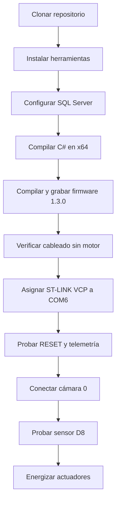
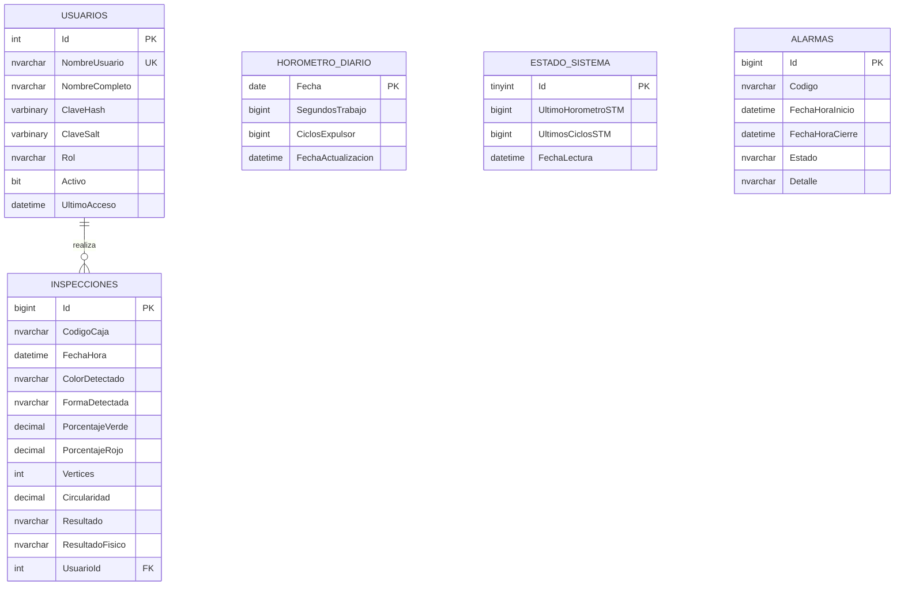
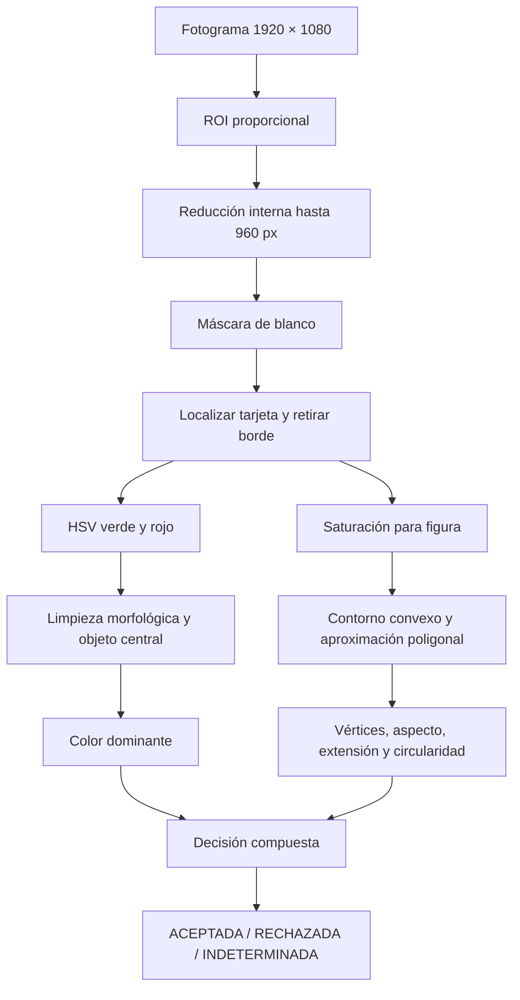

# Guía de instalación, configuración y uso de SICAVI

## 1. Propósito

Esta guía permite instalar, programar y operar la entrega final de SICAVI. Incluye la aplicación C#, SQL Server, la NUCLEO-G071RB, cámara, sensor de caja, motor y expulsor.

> **Seguridad:** durante las primeras pruebas desconecta físicamente el motor y el expulsor. Verifica primero LEDs, entradas, UART y niveles de tensión. La NUCLEO trabaja con lógica de 3.3 V.

## 2. Preparación general



## 3. Requisitos

### 3.1 Software

| Componente | Uso |
|---|---|
| Windows 10/11 x64 | Plataforma de la aplicación |
| Visual Studio 2022 | Diseño y compilación de WinForms |
| .NET 8 SDK | Framework de ejecución |
| STM32CubeIDE 1.17 o compatible | Compilación y depuración del firmware |
| STM32CubeProgrammer | Programación y verificación de la Flash |
| SQL Server / SQL Server Express | Persistencia de producción |
| Driver ST-LINK | Programador y puerto COM virtual |

En Visual Studio Installer activa la carga de trabajo **Desarrollo de escritorio de .NET**.

### 3.2 Hardware

- Placa NUCLEO-G071RB.
- Cámara USB compatible con DirectShow.
- Sensor infrarrojo de caja con salida compatible con 3.3 V y comportamiento activo en bajo.
- LDR y resistencia de 10 kΩ para divisor de tensión.
- Driver de motor o relé con transistor y diodo de rueda libre.
- Etapa de expulsor apropiada.
- Fuente separada para actuadores.
- Pulsador STOP y parada de emergencia física.

## 4. Obtener el código

```powershell
git clone https://github.com/yorkyg/SICAVI---Proyecto-Final-UTESA.git
cd SICAVI---Proyecto-Final-UTESA
```

No ejecutes la solución desde un archivo ZIP. Las rutas `bin`, `obj` y `Debug` se generan localmente y no forman parte del repositorio.

## 5. Configurar SQL Server

La configuración está en:

```text
CSharp/SICAVI_Camara_STM32/src/Sicavi.WinForms/database-settings.json
```

Valor incluido:

```json
{
  "server": ".\\WINCC",
  "database": "SICAVI",
  "integratedSecurity": true,
  "trustServerCertificate": true,
  "connectTimeoutSeconds": 8
}
```

Si tu instancia es diferente, cambia solamente `server`. Ejemplos:

```text
.\SQLEXPRESS
localhost\SQLEXPRESS
NOMBRE-PC\INSTANCIA
```

La primera ejecución necesita una cuenta de Windows con permiso para crear bases de datos. `DatabaseInitializer` abre `master`, ejecuta el script idempotente `Database/SICAVI.sql` y crea las tablas que falten.

### 5.1 Tablas creadas



## 6. Compilar la aplicación C#

1. Abre `CSharp/SICAVI_Camara_STM32/SICAVI.sln`.
2. Selecciona `Debug | x64`.
3. Espera la restauración de NuGet.
4. Confirma que `Sicavi.WinForms` sea el proyecto de inicio.
5. Compila con `Ctrl+Shift+B`.

Desde consola también puede verificarse:

```powershell
dotnet restore CSharp/SICAVI_Camara_STM32/SICAVI.sln
dotnet build CSharp/SICAVI_Camara_STM32/SICAVI.sln -c Debug
```

Dependencias principales:

- `OpenCvSharp4.Windows` y `OpenCvSharp4.Extensions` para visión y conversión de imágenes.
- `System.IO.Ports` para COM6.
- `Microsoft.Data.SqlClient` para SQL Server.

## 7. Compilar y programar el STM32

1. Abre STM32CubeIDE.
2. Selecciona **File > Import > Existing Projects into Workspace**.
3. Elige la carpeta `SICAVI_STM32_G071RB`.
4. Compila la configuración `Debug`.
5. Conecta el USB del ST-LINK.
6. Programa y verifica la memoria Flash.

Al arrancar, la placa transmite:

```text
EVT=BOOT;FW=1.3.0;BOARD=NUCLEO_G071RB
```

No es necesario regenerar el proyecto `.ioc` para compilar la entrega. Si se modifica CubeMX, revisa que no sobrescriba la biblioteca GPIO ni la lógica de aplicación.

## 8. Cableado

| Señal | Pin | Tipo | Activo | Observación |
|---|---|---|---|---|
| LDR | `PA0 / A0` | ADC | Analógico | Máximo 3.3 V |
| START local | `PC13 / B1` | Entrada | Bajo | Pull-up |
| STOP | `PC1` | Entrada | Bajo | Pull-up |
| Sensor de caja | `PA9 / D8` | EXTI | Bajo | 3.3 V sin caja, 0 V con caja |
| Motor | `PC7 / D9` | Salida | Alto | Hacia driver, nunca directo |
| Expulsor | `PB1` | Salida | Alto | Hacia driver o relé |
| LED aceptado | `PA5 / LD4` | Salida | Alto | LED integrado |
| LED rechazado | `PA6` | Salida | Alto | Resistencia de 330 Ω |
| LED estado/alarma | `PA7` | Salida | Alto | Parpadeo en alarma |
| UART TX/RX | `PA2 / PA3` | USART2 | — | ST-LINK VCP, 115200 8-N-1 |

Consulta el [mapa de conexiones](MAPA_PINES_Y_CONEXIONES.md) para los esquemas eléctricos.

## 9. Configurar COM6 y cámara 0

### 9.1 COM6

1. Abre **Administrador de dispositivos**.
2. Localiza `STMicroelectronics STLink Virtual COM Port`.
3. En propiedades avanzadas asigna `COM6`.
4. Cierra terminales seriales, CubeMonitor y otras aplicaciones que usen el puerto.

SICAVI intenta reconectar automáticamente cada dos segundos. El enlace usa 115200 bit/s, 8 bits, sin paridad y un bit de parada.

### 9.2 Cámara

La aplicación usa el índice `0` y la solicita a `1920 × 1080`. La cámara solo se abre al pulsar **INICIAR** y permanece activa hasta **DETENER**, cerrar sesión o cerrar el programa.

Si Windows asigna el índice 0 a la cámara integrada, desactívala temporalmente desde el Administrador de dispositivos o configura la webcam USB como dispositivo principal.

## 10. Primera ejecución y usuarios

Al iniciar, la aplicación prepara SQL Server y abre `LoginForm`.

Cuenta inicial temporal:

```text
Usuario: admin
Clave:   Sicavi@123
```

Después del primer ingreso:

1. Pulsa **GESTIÓN DE USUARIOS** en `01 · ACCESOS`.
2. Selecciona el administrador.
3. Escribe y confirma una nueva contraseña.
4. Guarda los cambios.

Las claves no se guardan como texto. Se usa PBKDF2-SHA256, sal aleatoria, 210 000 iteraciones y comparación en tiempo constante.

### 10.1 Acceso a los cinco formularios

| Formulario | Cómo se abre |
|---|---|
| Login | Automáticamente al iniciar o cerrar sesión |
| Registro | Botón **Registrar nuevo operador** del login |
| Principal | Después de autenticarse |
| Usuarios | Botón **GESTIÓN DE USUARIOS**, requiere Administrador |
| Producción | Botón **DATOS DE PRODUCCIÓN** |

El botón **CERRAR SESIÓN** detiene el sistema, libera cámara y COM6 y vuelve al login. La X termina la aplicación.

## 11. Operación normal

### 11.1 Antes de iniciar

- Sensor D8 libre y en nivel alto.
- Caja fuera de la zona del sensor.
- Cámara fija y perpendicular a la etiqueta.
- Iluminación uniforme.
- Parada física disponible.
- LDR dentro del rango configurado de 25 % a 90 % si el bloqueo por luz está habilitado.

### 11.2 Ejecutar una inspección

1. Selecciona el color esperado: Cualquiera, Verde o Rojo.
2. Selecciona la forma esperada: Cualquiera, Círculo, Cuadrado o Triángulo.
3. Pulsa **INICIAR**.
4. SICAVI confirma primero `RESET`, abre la cámara y luego confirma `RUN`.
5. La banda transporta la caja.
6. Cuando D8 baja a 0 V, el firmware entra en posicionamiento.
7. El motor conserva el avance configurado durante 400 ms y luego se detiene.
8. Después de 300 ms de estabilización, el STM32 emite `EVT=DETECTED`.
9. La aplicación captura un fotograma nuevo, analiza y registra el resultado.
10. `GOOD` deja pasar la caja; `REJECT` acciona el expulsor; `UNKNOWN` genera una alarma retenida.

La última imagen procesada permanece fija hasta la siguiente inspección, incluso si el ciclo termina en alarma.

### 11.3 Detener y reiniciar

- **DETENER** envía `CMD=STOP`, apaga motor y expulsor y cierra la cámara.
- **REINICIAR** envía `CMD=RESET` con reintentos cada 400 ms durante un máximo de cinco segundos.
- La aplicación solo cierra la alarma en SQL y en pantalla después de recibir `ACK=RESET`.
- Después del reinicio, pulsa **INICIAR** para comenzar un ciclo nuevo.

## 12. Funcionamiento de la visión



El color rojo usa dos rangos porque el tono rojo se encuentra en ambos extremos del canal H de OpenCV. La forma se obtiene por saturación y no depende de que el color ya haya sido reconocido; esto evita perder ambas variables por una misma variación de iluminación.

## 13. Calibración

Los parámetros están en:

```text
CSharp/SICAVI_Camara_STM32/src/Sicavi.WinForms/vision-settings.json
```

Campos recomendados para ajuste:

| Campo | Efecto |
|---|---|
| `green`, `redLow`, `redHigh` | Ventanas HSV |
| `minimumColorPercentage` | Evidencia mínima para declarar color |
| `minimumColorObjectAreaRatio` | Descarta manchas pequeñas |
| `shapeMinimumSaturation` | Separa figura de tarjeta blanca |
| `minimumShapeAreaPixels` | Descarta contornos pequeños |
| `polygonEpsilonRatio` | Simplificación del contorno |
| `minimumCircleCircularity` | Umbral de círculo |
| `squareAspectRatio...` | Tolerancia geométrica del cuadrado |
| `card...` | Localización de la tarjeta blanca |
| `roi...Ratio` | Posición proporcional de la zona de búsqueda |

Modifica un parámetro por vez y conserva imágenes de antes y después. Usa fotografías tomadas desde la posición definitiva de la máquina.

## 14. Datos de producción

En **DATOS DE PRODUCCIÓN** selecciona el rango de fechas y pulsa **ACTUALIZAR**.

- **Clasificaciones:** código de caja sin ceros iniciales, fecha, color, forma, porcentajes, geometría, resultado, motivo y operador.
- **Horómetro:** segundos diarios convertidos a tiempo legible y ciclos del expulsor.
- **Alarmas:** código en español, inicio, cierre, estado y detalle.
- **Indicadores:** aceptadas, rechazadas, indeterminadas y total.

Los incrementos de horómetro se calculan contra `EstadoSistema` para evitar duplicar los valores absolutos enviados por el STM32. Si la placa se reinicia y su contador vuelve a cero, SQL acumula el nuevo tramo como un incremento nuevo.

## 15. Alarmas y solución de problemas

| Alarma | Causa | Acción |
|---|---|---|
| Comunicación con PC perdida | No llegaron comandos durante 3.5 s | Revisar COM6/USB, pulsar Reiniciar |
| Error de comunicación UART | No pudo recuperarse la recepción | Revisar VCP, cable y firmware |
| Error del sensor de luz | ADC no completó la conversión | Revisar PA0 y divisor LDR |
| Iluminación fuera de rango | LDR fuera de 25–90 % | Corregir luz o calibrar límites |
| Tiempo de visión agotado | C# no respondió en 8 s | Revisar cámara, carga del PC y COM6 |
| Visión indeterminada | Color o forma sin confianza | Mejorar posición, enfoque, luz o parámetros |

### La base no abre

- Confirma que la instancia configurada esté iniciada.
- Comprueba permisos para crear y abrir `SICAVI`.
- Usa autenticación de Windows.
- Si la base existe pero el login falla, verifica que tu usuario tenga acceso a ella.

### La cámara no abre

- Cierra Teams, Zoom, OBS y la aplicación Cámara.
- Revisa permisos de cámara para aplicaciones de escritorio.
- Comprueba que el dispositivo soporte la resolución solicitada.
- Reconecta la webcam antes de abrir SICAVI.

### INICIAR es rechazado

- Retira la caja del sensor D8.
- Verifica que D8 mida aproximadamente 3.3 V sin caja.
- Reinicia cualquier alarma retenida.
- Revisa que el LDR esté dentro del rango permitido.

### RESET no confirma

- Espera hasta cinco segundos: el comando se reintenta automáticamente.
- Comprueba que la barra inferior muestre `COM6 · firmware 1.3.0`.
- Cierra cualquier terminal que use COM6.
- Reprograma el firmware 1.3.0 si la versión es diferente.

## 16. Pruebas recomendadas

1. Compilación C# Debug y Release.
2. Compilación STM32 sin advertencias críticas.
3. Diez RESET consecutivos sin RUN.
4. START/STOP sin relé.
5. Sensor D8 simulado llevando la entrada a GND.
6. Relé sin motor conectado.
7. Motor sin caja y con parada accesible.
8. Seis combinaciones: rojo/verde × círculo/cuadrado/triángulo.
9. Rechazo por color y por forma.
10. Indeterminado por imagen inválida.
11. Pérdida de PC durante RUN.
12. Consulta posterior de inspecciones, horómetro y alarmas en SQL.

Herramienta disponible:

```powershell
dotnet run --project tools/Sicavi.HardwareProbe/Sicavi.HardwareProbe.csproj -c Release -- --regresion
dotnet run --project tools/Sicavi.HardwareProbe/Sicavi.HardwareProbe.csproj -c Release -- --protocolo
```

`--protocolo` no envía RUN: mantiene el motor apagado y comprueba diez reinicios confirmados.

## 17. Cierre correcto

1. Pulsa **DETENER**.
2. Confirma motor y expulsor apagados.
3. Usa **CERRAR SESIÓN** si ingresará otro operador.
4. Cierra la aplicación.
5. Desenergiza actuadores antes de cambiar cableado.

