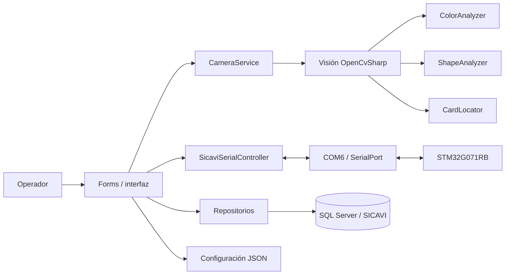
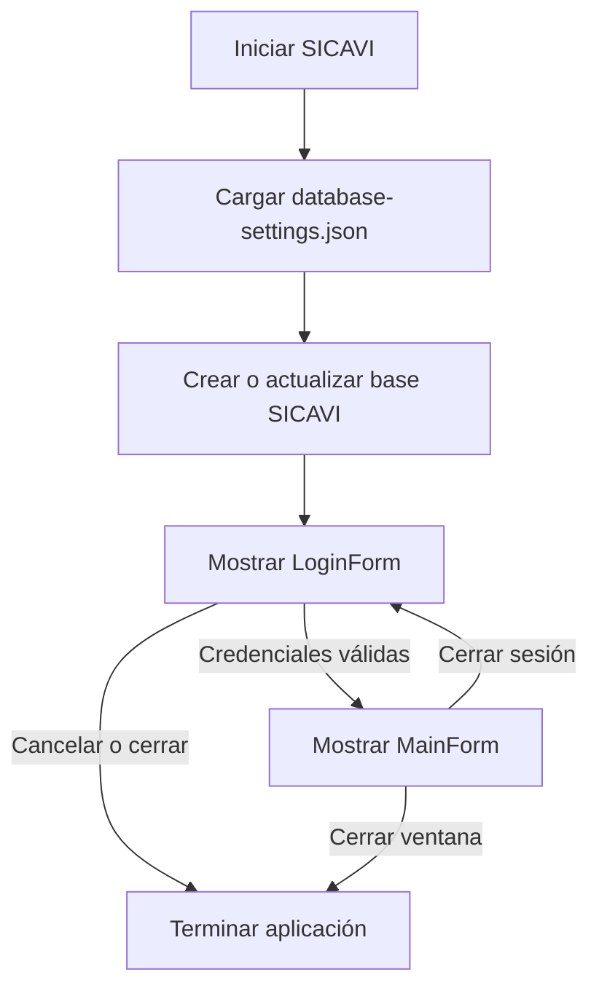
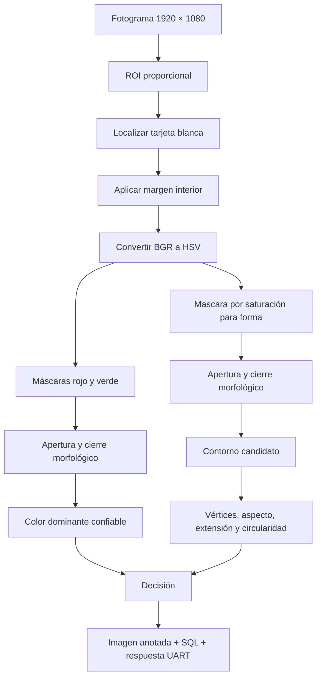
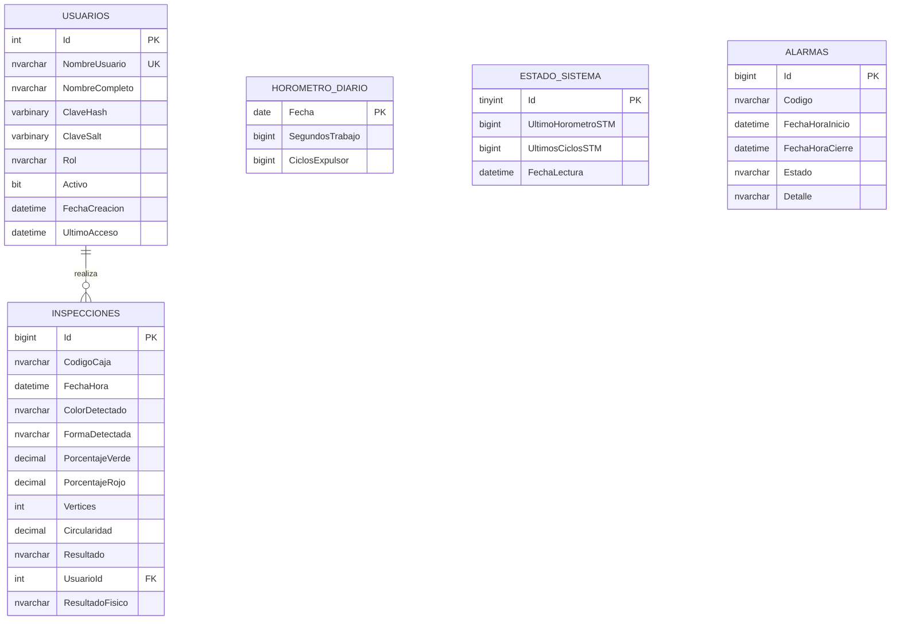
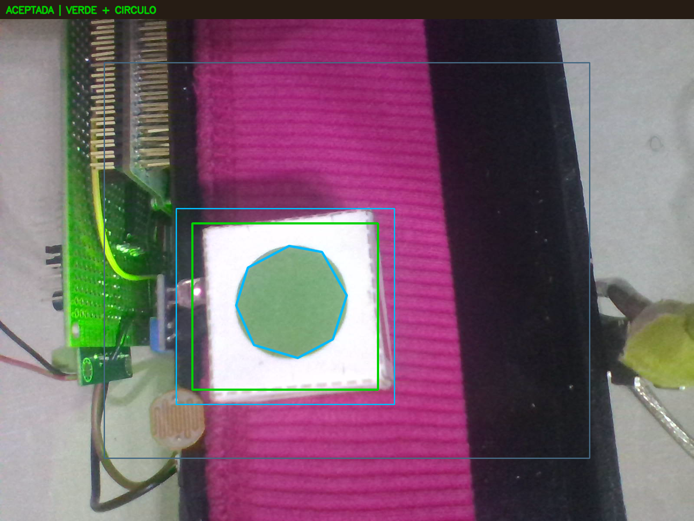

# Informe final de implementación C#

## SICAVI — Supervisión, visión artificial y trazabilidad de producción

**Aplicación:** SICAVI para Windows  
**Plataforma:** .NET 8, Windows Forms x64  
**Visión artificial:** OpenCvSharp 4.13  
**Persistencia:** SQL Server mediante Microsoft.Data.SqlClient  
**Comunicación de planta:** puerto serie COM6, 115200 bit/s  
**Cámara de proceso:** dispositivo 0, resolución solicitada 1920 × 1080

---

## 1. Resumen ejecutivo

La aplicación C# es el nivel de supervisión de SICAVI. Su función no es sustituir el control determinista del STM32, sino coordinar la autenticación, presentar el estado de la estación, mantener activa la cámara durante la producción, analizar cada caja cuando el microcontrolador confirma su posicionamiento, devolver la decisión y conservar la trazabilidad en SQL Server.

La solución final integra cinco formularios editables desde el diseñador de Visual Studio, un servicio de cámara, un subsistema de visión desacoplado, un controlador de comunicación serie, repositorios de datos, seguridad de contraseñas y configuración externa en JSON. La interfaz y los registros operativos se presentan en español.

Los criterios principales de diseño fueron:

- Mantener el control del motor y de las salidas críticas en el STM32.
- Analizar solamente una caja asociada a un identificador de inspección.
- No capturar por el simple hecho de abrir la cámara o iniciar la aplicación.
- Mantener fija la última imagen analizada hasta el siguiente escaneo.
- Evitar decisiones falsas: una lectura incierta se registra como indeterminada.
- Confirmar por protocolo las órdenes importantes antes de cambiar el estado de la interfaz o de cerrar alarmas.
- Separar interfaz, visión, comunicación, persistencia, modelos y seguridad.
- Conservar los formularios completos dentro de sus archivos `Designer.cs` para facilitar la edición visual.

---

## 2. Objetivos de la implementación

### 2.1 Objetivo general

Desarrollar una aplicación de escritorio industrial capaz de supervisar la estación SICAVI, clasificar las figuras de las cajas por color y geometría, intercambiar órdenes confiables con el STM32 y almacenar el historial de producción, operación y alarmas.

### 2.2 Objetivos específicos

1. Autenticar usuarios y diferenciar los permisos de Administrador y Operador.
2. Abrir automáticamente COM6 y la cámara 0 como recursos fijos de la máquina.
3. Mantener video disponible durante la producción sin confundirlo con una inspección.
4. Analizar un fotograma nuevo únicamente después de `EVT=DETECTED`.
5. Separar la tarjeta blanca del entorno para evitar clasificar el borde de la caja.
6. Reconocer rojo, verde, círculo, cuadrado y triángulo.
7. Enviar al STM32 una decisión vinculada al identificador recibido.
8. Registrar clasificaciones, conteos, horómetro y alarmas en SQL Server.
9. Facilitar la edición y el mantenimiento desde Visual Studio.
10. Recuperarse de desconexiones temporales sin bloquear la interfaz gráfica.

---

## 3. Tecnologías utilizadas y justificación

| Tecnología | Uso en SICAVI | Motivo de selección |
|---|---|---|
| C# 12 / .NET 8 | Lógica general de la aplicación | Tipado fuerte, tareas asíncronas, mantenimiento y soporte vigente |
| Windows Forms | Interfaz de operación | Integración directa con Windows, diseñador visual y baja complejidad de despliegue |
| OpenCvSharp 4.13 | Captura y análisis de imágenes | Expone OpenCV desde .NET y proporciona HSV, morfología y contornos |
| `System.IO.Ports` | Enlace COM6 con el STM32 | Acceso administrado a `SerialPort` y recepción por eventos |
| SQL Server | Historial y usuarios | Restricciones, transacciones, índices y herramientas de administración |
| `Microsoft.Data.SqlClient` | Acceso ADO.NET | Proveedor moderno y oficial para SQL Server |
| JSON | Calibración y conexión | Permite cambiar parámetros de instalación sin recompilar |
| PBKDF2-SHA256 | Protección de claves | Derivación lenta con salt individual; no almacena contraseñas en texto plano |

Referencias técnicas principales:

- [Windows Forms para .NET](https://learn.microsoft.com/dotnet/desktop/winforms/)
- [SerialPort en .NET](https://learn.microsoft.com/dotnet/api/system.io.ports.serialport)
- [Microsoft.Data.SqlClient](https://learn.microsoft.com/sql/connect/ado-net/introduction-microsoft-data-sqlclient-namespace)
- [Conversión de espacios de color en OpenCV](https://docs.opencv.org/4.x/d8/d01/group__imgproc__color__conversions.html)
- [Contornos y análisis estructural en OpenCV](https://docs.opencv.org/4.x/d3/dc0/group__imgproc__shape.html)

---

## 4. Arquitectura de la aplicación

La solución utiliza una arquitectura por responsabilidades. Los formularios presentan información y originan acciones; los servicios manejan recursos externos; los analizadores procesan imágenes; los repositorios encapsulan SQL; los modelos transportan datos entre capas.



### 4.1 Regla de responsabilidad

El STM32 decide cuándo una caja está físicamente detenida. C# decide qué contiene la imagen. Esta frontera evita que el tiempo de procesamiento visual gobierne directamente la parada del motor y mantiene el sistema seguro si la PC falla.

---

## 5. Estructura del programa

La aplicación se encuentra en:

```text
CSharp/SICAVI_Camara_STM32/
├── SICAVI.sln
├── GUIA_DE_USO.md
├── docs/
├── src/
│   └── Sicavi.WinForms/
│       ├── Communication/
│       ├── Configuration/
│       ├── Data/
│       ├── Database/
│       ├── Exceptions/
│       ├── Forms/
│       ├── Models/
│       ├── Security/
│       ├── Services/
│       ├── Utilities/
│       ├── Vision/
│       ├── Program.cs
│       ├── database-settings.json
│       └── vision-settings.json
└── tools/
    └── Sicavi.HardwareProbe/
```

### 5.1 `Communication`

- `SerialConnectionService.cs`: propiedad y ciclo de vida del puerto serie, envío de líneas y evento de recepción.
- `SerialMessageParser.cs`: convierte cada línea en tipo, nombre y pares clave/valor.
- `SicaviSerialController.cs`: órdenes, latido, reintentos, espera de ACK y transformación a eventos de dominio.
- `SicaviTelemetry.cs`: representa el último estado recibido del firmware.

### 5.2 `Configuration`

- `DatabaseSettings.cs`: carga y valida la instancia y base de datos.
- `VisionSettings.cs`: carga límites HSV, geometría de tarjeta, forma y ROI.

### 5.3 `Data` y `Database`

- `SqlConnectionFactory.cs`: crea conexiones cortas con la cadena configurada.
- `DatabaseInitializer.cs`: crea o actualiza la base al inicio y garantiza la cuenta inicial.
- `UserRepository.cs`: autenticación y administración de usuarios.
- `ProductionRepository.cs`: inspecciones, tablero, horómetro y alarmas.
- `SICAVI.sql`: definición repetible de tablas, índices, restricciones y normalización de datos anteriores.

### 5.4 `Forms`

Cada formulario se divide en:

- `NombreForm.cs`: comportamiento, eventos y reglas.
- `NombreForm.Designer.cs`: controles, posiciones, colores, tamaños y jerarquía visual.
- `NombreForm.resx`: recursos del diseñador.

Esta separación permite abrir el formulario en modo **Diseño** y ver la composición industrial antes de ejecutar el programa.

### 5.5 `Models`

Contiene usuarios, resultados de color, resultados de forma, resumen de visión, registros de producción y enumeraciones. Al usar modelos explícitos se evitan cadenas sueltas entre módulos.

### 5.6 `Security`

`PasswordHasher.cs` genera y verifica hashes PBKDF2-SHA256. Cada usuario tiene un salt aleatorio y la comparación se realiza en tiempo constante.

### 5.7 `Services`

`CameraService.cs` encapsula la cámara, el hilo de captura, el último fotograma válido, los eventos de imagen y la liberación segura de recursos.

### 5.8 `Vision`

- `CardLocator.cs`: encuentra la tarjeta blanca y calcula su región interior.
- `ColorAnalyzer.cs`: segmenta rojo y verde en HSV.
- `ShapeAnalyzer.cs`: extrae el objeto saturado y clasifica su contorno.
- `CompositeVisionAnalyzer.cs`: integra localización, color, forma, criterios esperados y diagnóstico gráfico.

---

## 6. Inicio, autenticación y cierre de sesión

`Program.cs` es el punto de entrada `[STAThread]`. Antes de mostrar la pantalla de acceso carga la configuración, prepara la base de datos e instancia los repositorios.



La repetición del login es intencional: **CERRAR SESIÓN** libera recursos y regresa al formulario de acceso sin tener que reiniciar el ejecutable.

### 6.1 Formularios y acceso

| Formulario | Cómo se abre | Finalidad |
|---|---|---|
| `LoginForm` | Automáticamente al iniciar o cerrar sesión | Autenticar usuario y clave |
| `RegistrationForm` | Enlace de registro desde el login | Crear una cuenta de operador |
| `MainForm` | Después de autenticar | Operación, visión y control STM32 |
| `ProductionDataForm` | **DATOS DE PRODUCCIÓN** en `01 · ACCESOS` | Conteos, inspecciones, horómetro y alarmas |
| `UserManagementForm` | **GESTIÓN DE USUARIOS** en `01 · ACCESOS` | Administración de cuentas; requiere Administrador |

---

## 7. Interfaz principal y experiencia de operación

`MainForm` emplea una paleta oscura, cian para información, verde para aceptación, rojo para rechazo y ámbar para advertencias. El lateral reúne accesos, criterios esperados, resultado y control. El centro conserva la imagen de cámara con ROI y el panel derecho presenta máscara y contorno.

No hay selector de cámara ni de COM porque son parámetros de instalación de la máquina:

- Cámara: índice `0`.
- Puerto: `COM6`.
- Velocidad: `115200` bit/s.

Esto reduce acciones accidentales del operador. La reconexión serie es automática y la cámara se abre durante la secuencia de inicio.

### 7.1 Estados en español

Los códigos internos del protocolo se traducen antes de mostrarse o almacenarse. Entre los estados visibles están:

- Detenido.
- Transportando.
- Posicionando.
- Estabilizando.
- Esperando resultado.
- Dejando pasar.
- Rechazando.
- Alarma.

Las decisiones se expresan como **Aceptada**, **Rechazada** e **Indeterminada**. Los colores y formas se almacenan como **Rojo**, **Verde**, **Círculo**, **Cuadrado**, **Triángulo** o su estado desconocido.

---

## 8. Gestión de la cámara

La cámara permanece activa mientras la estación está en ejecución. `CameraService` mantiene un ciclo de lectura independiente del hilo de la interfaz y publica fotogramas para la vista en vivo.

La existencia de video no autoriza una inspección. Una evaluación sólo comienza cuando llega un evento de detección válido desde el STM32. Esto soluciona el comportamiento anterior en el cual podía analizarse una imagen antes de mover la banda.

### 8.1 Captura asociada a una caja

1. El STM32 recibe el flanco del sensor de caja.
2. El firmware completa el avance configurado, apaga el motor y espera estabilización.
3. El STM32 envía `EVT=DETECTED;ID=n`.
4. C# reserva de forma atómica el procesamiento de imagen.
5. Se obtiene un fotograma nuevo posterior al evento.
6. Se ejecuta el análisis y se conserva una copia anotada.
7. Se envía `CMD=GOOD|REJECT|UNKNOWN;ID=n`, usando como comando la decisión correspondiente.

La última inspección y sus máscaras quedan fijas aunque el sistema pase a alarma o se detenga. Sólo una inspección posterior las reemplaza.

### 8.2 Concurrencia

`Interlocked` impide dos análisis simultáneos sobre la misma cámara. Las esperas de fotograma y de ACK son asíncronas, por lo que la ventana continúa respondiendo. Los objetos `Mat`, `Bitmap`, puerto y cámara se liberan al reemplazarse o al cerrar el formulario.

---

## 9. Canal de visión artificial



### 9.1 ROI proporcional

La región de interés se expresa como proporción del fotograma, no como coordenadas rígidas. La calibración actual utiliza:

- X: 15 %.
- Y: 12 %.
- Ancho: 70 %.
- Alto: 76 %.

El análisis puede reducirse hasta 960 píxeles de ancho para disminuir tiempo de cómputo conservando la relación geométrica.

### 9.2 Localización de la tarjeta

`CardLocator` busca una región de baja saturación y valor alto, compatible con la tarjeta blanca. Filtra por:

- Área relativa mínima y máxima.
- Relación ancho/alto.
- Extensión del contorno dentro de su rectángulo.
- Distancia al centro de la ROI.

Una vez localizada, se aplica un margen interior de 7.5 %. Así el borde blanco, el cartón y el fondo de la banda quedan fuera de la zona que determina la figura.

### 9.3 Reconocimiento de color

El fotograma interior se convierte de BGR a HSV. HSV separa mejor el tono de las variaciones de brillo que BGR.

El rojo necesita dos intervalos porque el tono se encuentra en ambos extremos de la escala de OpenCV:

- Rojo bajo: H de 0 a 20.
- Rojo alto: H de 150 a 179.
- Verde: H de 25 a 105.
- Saturación mínima: 30.
- Valor mínimo: 25.

Después de `InRange` se usa apertura para retirar puntos pequeños y cierre para completar huecos. Para cada color se conserva el contorno relevante que no toque el borde y cuyo puntaje combine área con cercanía al centro.

El porcentaje se calcula como:

```text
porcentaje = 100 × píxeles de la máscara relevante / píxeles de la región interior
```

Se exige al menos 2 %. Si ambos colores quedan por debajo o difieren menos de un punto porcentual, el resultado permanece desconocido.

### 9.4 Reconocimiento de forma

La forma no depende del color previamente identificado. Se crea una máscara de píxeles con saturación y valor suficientes; de ese modo una variación moderada de tono no hace fallar simultáneamente color y geometría.

Por cada contorno se calculan:

- Área `A`.
- Perímetro cerrado `P`.
- Aproximación poligonal con `epsilon = 0.03 × P`.
- Número de vértices.
- Relación entre los lados del rectángulo rotado.
- Extensión `A / área del rectángulo rotado`.
- Circularidad:

```text
C = 4 × π × A / P²
```

Una circunferencia ideal se aproxima a 1. Los criterios implementados son:

- Triángulo: tres vértices, o polígono corto con baja extensión y circularidad.
- Círculo: seis o más vértices, circularidad mínima 0.68 y extensión controlada.
- Cuadrado: de cuatro a ocho vértices, aspecto de 0.72 a 1.28 y extensión mínima 0.78.

Se descartan contornos pequeños, no convexos, excesivamente grandes o en contacto con el borde. Entre los restantes se favorece el de mayor área cercano al centro.

### 9.5 Decisión y reintentos

El resultado compara color y forma detectados con los criterios elegidos. **Cualquiera** actúa como comodín.

- Coincidencia de ambos criterios: aceptada.
- Clasificación válida que no coincide: rechazada.
- Color o forma sin confianza: indeterminada.

Si el primer análisis es indeterminado, la aplicación solicita dos fotogramas frescos adicionales. Sólo reemplaza el resultado si ambos reintentos coinciden en color y forma y dejan de ser indeterminados; entre ellos conserva el de mejor circularidad. Esta regla mejora la recuperación ante un fotograma borroso sin convertir una lectura aislada en una aceptación falsa.

---

## 10. Comunicación con el STM32

El enlace utiliza texto ASCII terminado en salto de línea. Este formato facilita depuración con terminal y permite agregar campos sin romper el analizador.

### 10.1 Mensajes principales

| Dirección | Ejemplo | Propósito |
|---|---|---|
| C# → STM32 | `CMD=RUN` | Iniciar transporte |
| C# → STM32 | `CMD=STOP` | Parada segura |
| C# → STM32 | `CMD=RESET` | Solicitar reinicio de alarma |
| C# → STM32 | `CMD=GOOD;ID=7` | Aprobar la inspección 7; también existen `REJECT` y `UNKNOWN` |
| C# → STM32 | `CMD=PING` | Mantener y comprobar el enlace |
| STM32 → C# | `EVT=DETECTED;ID=7` | Caja estable, solicitar visión |
| STM32 → C# | `TEL=STATUS;...` | Estado, luz, horómetro y ciclos |
| STM32 → C# | `EVT=ALARM;CODE=...` | Abrir alarma |
| STM32 → C# | `ACK=RESET;STATE=STOPPED;ALARM=NONE` | Confirmar reinicio real |

### 10.2 Fiabilidad aplicada

- Cada línea se analiza como clave y pares `clave=valor`.
- El controlador envía `PING` periódico durante la sesión activa.
- RUN, STOP y RESET disponen de espera de confirmación y reintento.
- Antes de esperar una respuesta se descartan confirmaciones antiguas que podrían pertenecer a una orden previa.
- La interfaz no marca una alarma como cerrada hasta recibir `ACK=RESET` con estado detenido y alarma nula.
- La desconexión de COM6 no bloquea la ventana; se informa y se intenta reconectar.
- Los eventos de detección incluyen `ID`, y la respuesta repite ese identificador para impedir resultados atrasados.

---

## 11. Base de datos SQL Server



### 11.1 `Usuarios`

Almacena identidad, rol, estado, hash, salt y auditoría de acceso. El nombre de usuario es único y el rol se restringe a Administrador u Operador.

### 11.2 `Inspecciones`

Registra el código de caja sin ceros iniciales, hora, color, forma, porcentajes, geometría, decisión visual, motivo, usuario y resultado físico. Los índices por fecha, resultado y caja aceleran el tablero.

### 11.3 `HorometroDiario` y `EstadoSistema`

La telemetría del STM32 es acumulativa. `EstadoSistema` conserva la última lectura y el repositorio calcula el incremento antes de sumarlo al día actual. Así una actualización repetida no duplica horas o ciclos.

### 11.4 `Alarmas`

Una alarma nace **ABIERTA** con fecha y detalle. El cierre almacena la hora sólo después de confirmarse el reinicio en el equipo. Los códigos técnicos conocidos se traducen al español.

### 11.5 Acceso a datos

Los repositorios usan conexiones de duración corta, comandos parametrizados y transacciones cuando una operación modifica datos relacionados. Las restricciones de SQL son una segunda línea de defensa frente a estados inválidos.

---

## 12. Seguridad de usuarios

Las claves nunca se guardan como texto. El procedimiento es:

1. Generar 32 bytes aleatorios de salt.
2. Derivar 64 bytes mediante PBKDF2-HMAC-SHA256.
3. Ejecutar 210 000 iteraciones.
4. Guardar hash y salt por separado.
5. En el login, derivar nuevamente y comparar en tiempo constante.

La base crea una cuenta administrativa inicial únicamente para permitir la primera configuración:

```text
Usuario: admin
Clave temporal: Sicavi@123
```

Debe cambiarse inmediatamente desde **GESTIÓN DE USUARIOS**. La cadena predeterminada usa autenticación integrada de Windows; no se versionan contraseñas de SQL Server.

---

## 13. Configuración externa

### 13.1 Base de datos

`database-settings.json` define servidor, base y opciones de cifrado. La instalación actual utiliza `.\\WINCC` en JSON y autenticación de Windows.

### 13.2 Visión

`vision-settings.json` reúne todos los umbrales relevantes. Separar calibración y código permite ajustar iluminación, escala y cámara sin recompilar.

Los parámetros no deben modificarse todos a la vez. El procedimiento recomendado es guardar imágenes reales, cambiar un grupo —tarjeta, color o forma—, ejecutar la regresión y comparar diagnósticos.

---

## 14. Gestión de errores y recursos

- Un error inicial de SQL se presenta antes del login con la ruta de configuración a revisar.
- Una cámara ocupada o desconectada cancela RUN de forma controlada.
- Una excepción de visión produce resultado indeterminado, nunca una aceptación implícita.
- La pérdida de comunicación se refleja como alarma de planta.
- Los manejadores provenientes de cámara y serial regresan al hilo de interfaz mediante invocación segura.
- `Dispose` libera cámara, imágenes, temporizadores, puerto y formularios.
- El registro técnico se conserva fuera de la ventana principal para no saturar al operador.

---

## 15. Compilación y ejecución

### 15.1 Requisitos

- Windows 10 u 11 x64.
- Visual Studio 2022 con desarrollo de escritorio .NET, o SDK .NET 8.
- SQL Server con una instancia accesible.
- Cámara USB asignada al índice 0.
- ST-LINK Virtual COM Port asignado como COM6.

### 15.2 Compilar

```powershell
dotnet restore CSharp/SICAVI_Camara_STM32/SICAVI.sln
dotnet build CSharp/SICAVI_Camara_STM32/SICAVI.sln -c Debug
dotnet build CSharp/SICAVI_Camara_STM32/SICAVI.sln -c Release
```

### 15.3 Ejecutar

```powershell
dotnet run --project CSharp/SICAVI_Camara_STM32/src/Sicavi.WinForms/Sicavi.WinForms.csproj -c Release
```

Para producción conviene compilar o publicar como x64, copiar ambos JSON junto al ejecutable y conservar el script `Database/SICAVI.sql`.

---

## 16. Verificación y resultados

### 16.1 Compilación

La entrega se valida en configuraciones Debug y Release. Nullable está habilitado, el objetivo es `net8.0-windows` y la plataforma es x64 para mantener compatibilidad con las bibliotecas nativas de OpenCV.

### 16.2 Regresión de visión

La herramienta `Sicavi.HardwareProbe` ejecuta un conjunto de seis referencias sintéticas:

- Círculo rojo.
- Círculo verde.
- Cuadrado rojo.
- Cuadrado verde.
- Triángulo rojo.
- Triángulo verde.

Resultado final: **6 de 6 casos reconocidos**.

### 16.3 Evidencia real

La imagen siguiente procede de la instalación física. El sistema localiza la tarjeta, aplica el interior, reconoce rojo y círculo y conserva la anotación de la inspección:



### 16.4 Prueba de protocolo

La herramienta de diagnóstico comprueba mensajes, telemetría y diez reinicios confirmados sin enviar RUN. Esta modalidad mantiene el motor apagado y detecta problemas de recepción o ACK antes de una prueba con movimiento.

---

## 17. Decisiones de diseño destacadas

### 17.1 Cámara activa, captura condicionada

Mantener la cámara abierta elimina el costo de reconectarla por cada producto. Separar vista en vivo de captura evita analizar antes de que el sensor y el STM32 confirmen la posición.

### 17.2 Tarjeta antes que figura

Buscar primero la superficie blanca reduce el espacio de búsqueda y evita que el borde exterior o la banda compitan con la figura.

### 17.3 Indeterminado como estado válido

Forzar una categoría cuando la confianza es insuficiente oculta fallos. SICAVI conserva **Indeterminada**, activa el tratamiento seguro y deja evidencia para recalibración.

### 17.4 SQL mediante repositorios

Los formularios no construyen consultas. Esto facilita cambiar la presentación, probar la lógica y mantener consistencia de transacciones.

### 17.5 Diseñador de WinForms

La creación de controles está en los archivos `Designer.cs` sin bucles complejos que el diseñador no pueda interpretar. El aspecto mostrado en Visual Studio representa la interfaz real de ejecución.

---

## 18. Limitaciones y mejoras futuras

- El índice de cámara y COM son fijos para la maqueta actual; otra instalación requiere cambiar la configuración o agregar un archivo de máquina.
- HSV depende de iluminación relativamente estable. Una luminaria difusa y exposición fija mejoran más que ampliar excesivamente los rangos.
- El análisis geométrico cubre las tres figuras académicas. Nuevas formas requieren reglas o un clasificador entrenado.
- SQL Server es local; una planta distribuida podría separar base, API y estación.
- Se puede incorporar exportación a Excel/PDF, indicadores OEE y niveles adicionales de auditoría.
- Una calibración futura podría almacenar perfiles por cámara y bloquear cambios con rol de Administrador.

---

## 19. Conclusión

La implementación C# de SICAVI integra en una sola estación autenticación, operación industrial, visión artificial, comunicación confiable y trazabilidad. La solución evita acoplar la seguridad física al rendimiento de la PC: el STM32 conserva el control de movimiento, mientras C# aporta análisis y supervisión.

La organización por capas explica claramente qué se utiliza, cómo se utiliza y por qué. Los formularios permanecen editables, la calibración se externaliza, las claves se protegen, los mensajes importantes se confirman y las decisiones quedan registradas en español. Con las compilaciones, la regresión de seis figuras y la evidencia física, la aplicación queda preparada como entrega académica reproducible y como base para mejoras industriales posteriores.
