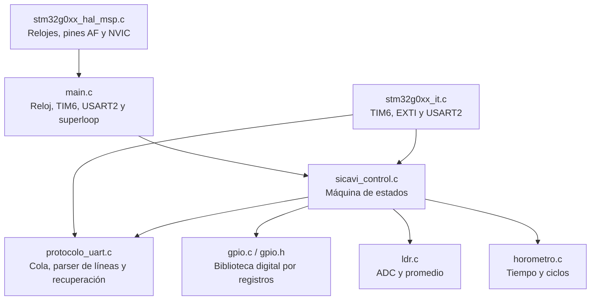
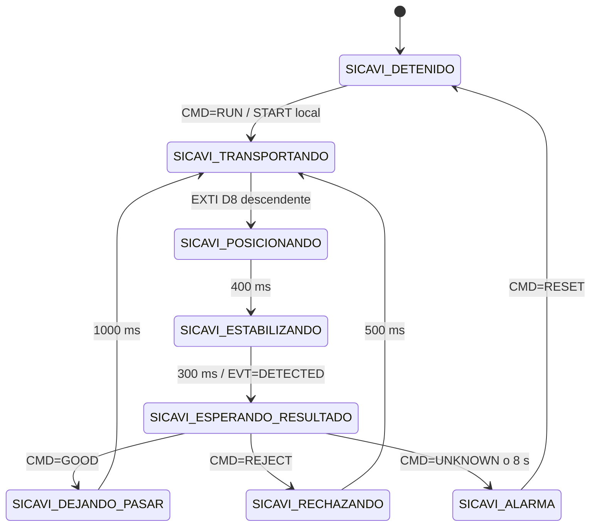

# Informe final de implementación STM32

## SICAVI — Control embebido de la estación de inspección

**Plataforma:** NUCLEO-G071RB  
**Microcontrolador:** STM32G071RBT6, Cortex-M0+  
**Firmware:** 1.3.0  
**Entorno:** STM32CubeIDE 1.17, STM32 HAL y biblioteca GPIO académica  
**Interfaz de supervisión:** USART2 por ST-LINK Virtual COM Port

---

## 1. Resumen ejecutivo

La implementación STM32 de SICAVI controla en tiempo real una banda transportadora para inspección y clasificación de cajas. El firmware recibe las órdenes de la aplicación C#, acciona el motor, detecta la llegada de la caja mediante una entrada activa en bajo, posiciona el producto, solicita una evaluación visual, ejecuta la decisión física y conserva un estado seguro ante fallos.

La lógica se diseñó como una máquina de estados no bloqueante gobernada por un tick de 10 ms. La interrupción del sensor se limita a registrar el evento; temporizaciones, comunicación y actuación se resuelven en el lazo principal. Esta separación reduce el trabajo dentro de las ISR y hace que STOP, UART y telemetría continúen disponibles durante el ciclo.

El firmware final incorpora:

- Máquina de ocho estados operativos.
- Sensor de caja en `D8 / PA9`, activo en bajo y con EXTI descendente.
- Motor en `D9 / PC7` y expulsor en `PB1`.
- Medición LDR por ADC de 12 bits en `PA0`.
- START y STOP locales activos en bajo.
- Horómetro de tiempo de motor y contador de ciclos del expulsor.
- Protocolo UART ASCII con comandos, ACK, eventos, errores y telemetría.
- Watchdog de comunicación con el PC.
- Autorrecuperación de la recepción UART.
- Alarmas retenidas que requieren un RESET confirmado.

## 2. Objetivos de la implementación

### 2.1 Objetivo general

Desarrollar el control embebido responsable de transportar, posicionar y clasificar físicamente cada caja de acuerdo con la decisión de visión calculada en el computador.

### 2.2 Objetivos específicos

1. Garantizar una posición repetible de la caja bajo la cámara.
2. Mantener el motor apagado en inicialización, parada y alarma.
3. Detectar el sensor activo en bajo con baja latencia.
4. Evitar capturas fuera de ciclo.
5. Entregar un identificador único por caja durante la sesión del MCU.
6. Exigir correspondencia entre el ID evaluado y el ciclo activo.
7. Aplicar timeout cuando la visión o el PC dejan de responder.
8. Reportar estado, luz, horómetro, ciclos y alarmas cada segundo.
9. Permitir diagnóstico y recuperación sin reiniciar físicamente la placa.

## 3. Selección del hardware

La NUCLEO-G071RB es apropiada para el proyecto por las siguientes razones:

- Núcleo Cortex-M0+ suficiente para control secuencial, ADC y UART.
- GPIO a 3.3 V compatibles con sensores lógicos.
- ADC de 12 bits para el LDR.
- Temporizadores internos para la base de tiempo.
- EXTI para respuesta rápida al sensor de caja.
- ST-LINK integrado para programación, depuración y puerto COM virtual.
- Conectores Arduino y ST Morpho que facilitan la maqueta.

Referencias oficiales:

- [Manual de usuario NUCLEO-G071RB](https://www.st.com/resource/en/user_manual/dm00452640.pdf)
- [Manual de referencia STM32G0x1 — RM0444](https://www.st.com/resource/en/reference_manual/rm0444-stm32g0x1-advanced-armbased-32bit-mcus-stmicroelectronics.pdf)
- [Descripción de los controladores HAL y LL](https://www.st.com/resource/en/user_manual/um2319-description-of-stm32g0-hal-and-lowlayer-drivers-stmicroelectronics.pdf)

## 4. Arquitectura del firmware



### 4.1 Estructura de carpetas

| Ruta | Responsabilidad |
|---|---|
| `Inc/main.h` | Inclusiones HAL, símbolos de pines y manejador de error |
| `Inc/sicavi_config.h` | Versión, pines, polaridades y tiempos configurables |
| `Inc/sicavi_control.h` | Interfaz pública del controlador |
| `Inc/protocolo_uart.h` | Interfaz de transporte UART |
| `Inc/gpio.h` | Mapa de registros y API GPIO académica |
| `Inc/ldr.h` | Modelo de medición LDR |
| `Inc/horometro.h` | Modelo del horómetro |
| `Src/main.c` | Inicialización y superloop |
| `Src/sicavi_control.c` | Estado operativo, alarmas y comandos |
| `Src/protocolo_uart.c` | Recepción por interrupción y transmisión de tramas |
| `Src/gpio.c` | Operaciones digitales mediante registros |
| `Src/ldr.c` | Inicialización y lectura del ADC1 |
| `Src/horometro.c` | Contadores de trabajo y expulsión |
| `Src/stm32g0xx_it.c` | Vectores de interrupción |
| `Src/stm32g0xx_hal_msp.c` | Configuración MSP de TIM6 y USART2 |
| `Drivers/` | CMSIS y HAL de ST con sus licencias |
| `Startup/` | Código de arranque Cortex-M0+ |

## 5. Inicialización del sistema

El flujo de `main()` es deliberadamente corto:

1. `HAL_Init()` inicializa la HAL y SysTick.
2. `SystemClock_Config()` configura HSI y PLL para 64 MHz.
3. `MX_TIM6_Init()` crea una interrupción cada 10 ms.
4. `MX_USART2_UART_Init()` prepara USART2 a 115200 8-N-1.
5. `sicavi_inicializar()` prepara lógica, entradas, salidas, ADC, UART y estado inicial.
6. Se inicia TIM6 con interrupción.
7. El superloop ejecuta continuamente `sicavi_procesar()`.

Las salidas del motor y expulsor se escriben inactivas durante la inicialización. El primer estado es `SICAVI_DETENIDO`.

## 6. Asignación de pines

| Función | Pin físico lógico | Dirección | Polaridad | Justificación |
|---|---|---|---|---|
| LDR | `PA0 / A0` | Entrada ADC | 0–3.3 V | Canal ADC accesible en conector Arduino |
| LED aceptado | `PA5 / D13 / LD4` | Salida | Alto | Indicador integrado de la NUCLEO |
| LED rechazado | `PA6 / D12` | Salida | Alto | Indicador de resultado negativo |
| LED estado/alarma | `PA7 / D11` | Salida | Alto/parpadeo | Señal de marcha o alarma |
| Motor | `PC7 / D9` | Salida | Alto | Control de driver/relé |
| Expulsor | `PB1 / A3` | Salida | Alto | Control de etapa de expulsión |
| Sensor caja | `PA9 / D8` | Entrada EXTI | Bajo | Posición solicitada por la maqueta |
| STOP | `PC1` | Entrada | Bajo | Parada externa con pull-up |
| START | `PC13 / B1` | Entrada | Bajo | Botón integrado de usuario |
| UART TX | `PA2` | AF1 | — | ST-LINK VCP |
| UART RX | `PA3` | AF1 | — | ST-LINK VCP |

El sensor de caja entrega aproximadamente 3.3 V sin producto y 0 V al detectar. Por ello se utiliza pull-up y flanco descendente. Una caja presente antes de `RUN` produce un rechazo explícito `BOX_SENSOR_ACTIVE`, porque no existiría un flanco nuevo para iniciar el ciclo.

## 7. Biblioteca GPIO

### 7.1 Estructura

La biblioteca `gpio.h/gpio.c` implementa una capa digital independiente de la API HAL para fines académicos. Define:

- Direcciones base de RCC y GPIO.
- Estructuras `BloqueRelojGpio` y `BloquePuertoGpio` alineadas con los registros.
- Enumeraciones `PuertoDigital`, `NivelDigital` y `EstadoGpio`.
- Validación de puerto, pin, máscara, nivel y punteros.
- Escritura atómica mediante `BSRR`.

### 7.2 Operaciones públicas

| Función | Acción |
|---|---|
| `puerto_habilitar` | Activa el reloj I/O en `RCC->IOPENR` |
| `pin_configurar_entrada` | Programa `MODER` y elimina resistencias |
| `pin_configurar_salida` | Selecciona salida push-pull de baja velocidad |
| `pin_leer` | Lee `IDR` y devuelve nivel validado |
| `pin_escribir` | Usa `BSRR` para set/reset atómico |
| `pin_alternar` | Invierte el estado lógico |
| `puerto_leer_bits` | Obtiene un grupo enmascarado |
| `puerto_escribir_bits` | Actualiza un grupo con una sola escritura BSRR |

### 7.3 Por qué se combina con HAL

La biblioteca se utiliza en las entradas y salidas digitales controladas por la aplicación. HAL se conserva para reloj, temporizador, UART, NVIC y EXTI porque ofrece inicialización validada para periféricos complejos. El ADC usa registros directos para demostrar configuración de bajo nivel y mantener control explícito sobre calibración, canal y tiempo de muestreo.

Esta combinación satisface el requisito académico de una biblioteca GPIO propia sin duplicar innecesariamente controladores completos de periféricos.

## 8. Base de tiempo y ejecución no bloqueante

TIM6 se configura con:

- Reloj de 64 MHz.
- Prescaler `63999`.
- Periodo `9`.
- Interrupción cada 10 ms.

La ISR incrementa `ticks_pendientes`; no ejecuta la máquina completa. El superloop consume los ticks y llama `procesar_tick_10ms()`.

Ventajas:

- Las ISR permanecen cortas.
- Los tiempos de motor, estabilización, visión y expulsor se expresan de forma uniforme.
- UART se procesa antes del lote de ticks pendiente.
- No se usan retardos largos que bloqueen STOP o comunicación.

## 9. Máquina de estados



### 9.1 `SICAVI_DETENIDO`

Motor y expulsor están apagados. No se aplica timeout de comunicación porque una aplicación cerrada no debe convertir una parada segura en alarma. `RUN` exige ausencia de alarma, sensor de caja libre y luz válida cuando el bloqueo está habilitado.

### 9.2 `SICAVI_TRANSPORTANDO`

Motor activo. Se admiten D8, STOP, telemetría y vigilancia de comunicación. El flanco descendente de D8 cambia inmediatamente a posicionamiento y reserva una sola detección.

### 9.3 `SICAVI_POSICIONANDO`

El motor sigue activo durante `SICAVI_AVANCE_TRAS_SENSOR_MS`, actualmente 400 ms. Este tiempo compensa la distancia física entre el haz del sensor y el centro de la ROI.

### 9.4 `SICAVI_ESTABILIZANDO`

El motor ya está apagado. Se esperan 300 ms para reducir desenfoque, vibración y variación de exposición antes de solicitar imagen.

### 9.5 `SICAVI_ESPERANDO_RESULTADO`

Se incrementa el contador de cajas, se genera un ID decimal sin ceros iniciales y se emite `EVT=DETECTED`. Solo se acepta un resultado con el mismo ID. Si C# no responde en ocho segundos se activa `VISION_TIMEOUT`.

### 9.6 `SICAVI_DEJANDO_PASAR`

Ante `GOOD`, el motor avanza durante un segundo y después vuelve a transportar. Se emite `EVT=FINISHED`.

### 9.7 `SICAVI_RECHAZANDO`

Ante `REJECT`, se activa el expulsor durante 500 ms, se incrementa su contador y se retorna a transporte.

### 9.8 `SICAVI_ALARMA`

Motor y expulsor apagados. El código queda retenido. Solo `RESET` borra la alarma y confirma:

```text
ACK=RESET;STATE=STOPPED;ALARM=NONE
```

## 10. Sensor de caja y antirrebote

El sensor dispone de dos rutas complementarias:

1. **EXTI descendente:** respuesta rápida al paso de 3.3 V a 0 V.
2. **Muestreo cada 10 ms:** respaldo con antirrebote si el flanco no se atendió.

La ISR no transmite UART ni aplica retardos. Solo cambia el estado y marca `deteccion_sensor_pendiente`. El lazo principal configura el vencimiento de posicionamiento.

START, STOP y el sensor usan `EntradaAntirrebote`, con muestra estable, última muestra y contador. El umbral actual es 30 ms.

## 11. Medición de luz

`ldr.c` configura ADC1 directamente:

- `PA0` en modo analógico.
- Reloj ADC síncrono PCLK/2, 32 MHz.
- Calibración previa a habilitación.
- Canal 0.
- Tiempo de muestreo de 79.5 ciclos.
- Ocho muestras por medición.

Se calcula:

```text
promedio = suma de 8 conversiones / 8
milivoltios = promedio × 3300 / 4095
porcentaje = promedio × 100 / 4095
```

La lectura se actualiza cada 200 ms. Con `SICAVI_BLOQUEO_POR_LUZ_HABILITADO = 1`, cinco muestras consecutivas fuera de 25–90 % generan `LIGHT_OUT_OF_RANGE` durante operación.

El LDR no sustituye la calibración HSV; funciona como supervisión global de iluminación y diagnóstico de instalación.

## 12. Horómetro

El modelo `HorometroSicavi` mantiene:

- `segundos_trabajo`: aumenta una vez por segundo mientras `motor_activo` es verdadero.
- `ciclos_expulsor`: aumenta en el flanco lógico de activación del expulsor.

Los valores son volátiles en el STM32 y vuelven a cero tras reinicio o reprogramación. C# los persiste por incrementos en SQL Server; por ello el histórico diario no se pierde cuando el contador del MCU reinicia.

## 13. Protocolo UART

### 13.1 Formato

```text
CATEGORIA=NOMBRE;CAMPO=VALOR;CAMPO=VALOR\r\n
```

Categorías:

- `CMD`: comandos de C#.
- `ACK`: confirmación del STM32.
- `ERR`: rechazo de un comando.
- `EVT`: suceso asíncrono.
- `TEL`: telemetría periódica.

### 13.2 Comandos

| Comando | Resultado |
|---|---|
| `CMD=RUN` | Verifica condiciones y arranca transporte |
| `CMD=STOP` | Apaga actuadores y pasa a STOP |
| `CMD=RESET` | Borra alarma, ID y resultado; no borra horómetro |
| `CMD=STATUS` | Envía telemetría inmediata |
| `CMD=PING` | Renueva watchdog sin responder |
| `CMD=GOOD;ID=n` | Aprueba el ciclo activo |
| `CMD=REJECT;ID=n` | Rechaza el ciclo activo |
| `CMD=UNKNOWN;ID=n` | Declara visión indeterminada y activa alarma |

### 13.3 Telemetría

Cada segundo se transmite:

```text
TEL=STATUS;FW=1.3.0;STATE=TRANSPORTING;MOTOR=1;BOX_SENSOR=0;
LIGHT=65;ADC=2668;MV=2150;HOURMETER_S=16;CYCLES=0;ALARM=NONE
```

La versión en cada trama permite comprobar que C# y la placa ejecutan una entrega compatible incluso si el evento de arranque ocurrió antes de abrir COM6.

## 14. Robustez de recepción UART

La recepción usa interrupción de un byte y una cola circular de ocho líneas completas. Esta arquitectura separa el tiempo de ISR del procesamiento de comandos.

### 14.1 Cola circular

- Línea máxima: 128 caracteres.
- Ocho líneas pendientes.
- Índices de lectura y escritura independientes.
- Secciones críticas breves al extraer.
- Una línea excesiva o una cola llena genera recuperación controlada.

### 14.2 Supervisor de recepción

El ST-LINK VCP puede sufrir overrun, ruido o una recepción HAL que queda sin interrupción activa después de reconectar USB. El firmware vigila el tiempo desde el último byte.

Si pasan 1800 ms sin bytes:

1. Aborta la recepción HAL actual.
2. Descarta solamente la línea parcial.
3. Rearma `HAL_UART_Receive_IT`.
4. Permite que el siguiente PING o RESET sea recibido antes del timeout de comunicación.

Un error transitorio recuperado no activa por sí mismo una alarma. `UART_ERROR` se retiene si el rearme no puede completarse.

### 14.3 Watchdog PC–MCU

Cada comando válido actualiza `ultima_comunicacion_ms` usando `HAL_GetTick()`. Si el sistema está operativo y transcurren 3500 ms sin comandos, se activa `COMM_TIMEOUT` y el motor se apaga.

Se usa tiempo absoluto HAL para evitar falsos vencimientos si existiera una acumulación temporal de ticks de la máquina de estados.

## 15. Alarmas

| Código | Condición | Respuesta segura |
|---|---|---|
| `UART_ERROR` | No fue posible recuperar recepción | Motor y expulsor apagados |
| `ADC_ERROR` | ADC sin conversión válida | Activa alarma si el sistema opera |
| `LIGHT_OUT_OF_RANGE` | Cinco lecturas fuera de límites | Detiene la estación |
| `VISION_TIMEOUT` | Sin respuesta C# durante 8 s | Retiene caja y detiene |
| `COMM_TIMEOUT` | Sin contacto PC durante 3.5 s | Detiene la estación |
| `VISION_UNKNOWN` | La visión no pudo decidir | Requiere corrección y RESET |

`activar_alarma()` evita reemplazar una alarma ya retenida; el primer fallo conserva la causa original.

## 16. Indicadores y actuadores

- En STOP, las salidas indicadoras quedan apagadas según la lógica final del proyecto.
- Durante operación, `PA7` indica estado activo.
- Una decisión `GOOD` activa el indicador aceptado.
- Una decisión `REJECT` activa el indicador rechazado.
- En alarma, el indicador de estado se conmuta periódicamente.

Motor y expulsor se controlan mediante funciones únicas. Esto centraliza polaridad y permite cambiar `SICAVI_DRIVER_MOTOR_ACTIVO_ALTO` o `SICAVI_RELE_EXPULSOR_ACTIVO_ALTO` sin modificar la máquina de estados.

## 17. Parámetros configurables

Todos los parámetros de instalación están reunidos en `Inc/sicavi_config.h`:

| Parámetro | Valor final | Motivo |
|---|---:|---|
| Tick | 10 ms | Resolución suficiente sin sobrecargar ISR |
| Avance tras sensor | 400 ms | Centrar la caja en la ROI física |
| Estabilización | 300 ms | Reducir movimiento antes de foto |
| Timeout de visión | 8000 ms | Margen para captura y reintento |
| Timeout de PC | 3500 ms | Tres latidos perdidos aproximadamente |
| Paso aceptado | 1000 ms | Liberar zona de inspección |
| Expulsor | 500 ms | Pulso mecánico de rechazo |
| Telemetría | 1000 ms | Actualización legible y de bajo tráfico |
| LDR | 200 ms | Filtrado y reacción estable |
| Antirrebote | 30 ms | Pulsadores y sensor sin duplicados |

## 18. Decisiones de diseño: cómo y por qué

### Máquina de estados frente a retardos bloqueantes

Se eligió máquina de estados porque un `HAL_Delay` largo impediría responder de manera oportuna a STOP, RESET y UART. Los vencimientos permiten que todas las responsabilidades avancen cooperativamente.

### Detección por EXTI más respaldo por muestreo

EXTI reduce la latencia respecto a revisar el pin únicamente cada 10 ms. El respaldo antirrebote aporta tolerancia si el flanco coincide con una condición transitoria.

### ID de caja en el protocolo

El ID evita aplicar a la caja actual una decisión retrasada de un ciclo anterior. `ID_MISMATCH` permite diagnosticar el problema sin accionar el expulsor.

### Alarma retenida

Una alarma no se borra por recibir telemetría ni por intentar RUN. El operador debe corregir la causa y ejecutar RESET; C# espera el ACK antes de cerrar el historial de alarma.

### Configuración centralizada

Pines, polaridades y tiempos se mantienen en un encabezado único para adaptar la maqueta sin dispersar números mágicos por el código.

## 19. Compilación y consumo de memoria

La compilación final de depuración produjo aproximadamente:

```text
text: 28 896 bytes
data:     92 bytes
bss:   3 412 bytes
```

El tamaño se encuentra dentro de los recursos del STM32G071RBT6. Las estructuras más relevantes en RAM son la cola UART, buffers de transmisión y estado de control.

## 20. Verificación realizada

### 20.1 Compilación

- Proyecto compilado con GCC ARM incluido en STM32CubeIDE.
- ELF generado correctamente.
- Programación y verificación completadas mediante STM32CubeProgrammer.

### 20.2 Placa real

Se ejecutó una prueba que no envía `RUN` y conserva el motor apagado:

- Conexión a COM6.
- Diez comandos RESET.
- Diez respuestas `ACK=RESET`.
- Estado final `STOPPED`.
- Alarma final `NONE`.
- Versión informada `1.3.0`.

La evidencia está en [`evidencias/prueba-reset-firmware-1.3.0.log`](evidencias/prueba-reset-firmware-1.3.0.log).

## 21. Limitaciones y mejoras futuras

1. El horómetro del MCU es volátil; podría añadirse persistencia periódica en Flash con estrategia de desgaste.
2. El protocolo no incluye CRC; para cables largos o ambientes ruidosos conviene agregar checksum y número de secuencia.
3. USART2 usa transmisión bloqueante corta; una versión futura puede usar DMA TX y recepción circular DMA-to-idle.
4. Los tiempos de posicionamiento son fijos; un encoder permitiría control por distancia.
5. Para sensores industriales de 12/24 V se requiere aislamiento y acondicionamiento externo.
6. La parada de software no sustituye un circuito de emergencia cableado que corte potencia.
7. El contador de ID reinicia con el MCU; SQL mantiene su propio identificador persistente.

## 22. Conclusión

La implementación STM32 cumple la función de control determinista y seguro de SICAVI. El firmware separa periféricos, protocolo y lógica de proceso, utiliza estados explícitos, evita bloqueos prolongados y valida todas las decisiones antes de accionar la mecánica. La incorporación del sensor activo en bajo, el posicionamiento temporizado, el handshake UART, la recuperación del receptor y las alarmas retenidas resuelve los principales riesgos observados durante las pruebas físicas.

El resultado es una base embebida modular, comprensible y extensible, adecuada tanto para la demostración académica como para una maqueta industrial supervisada.

